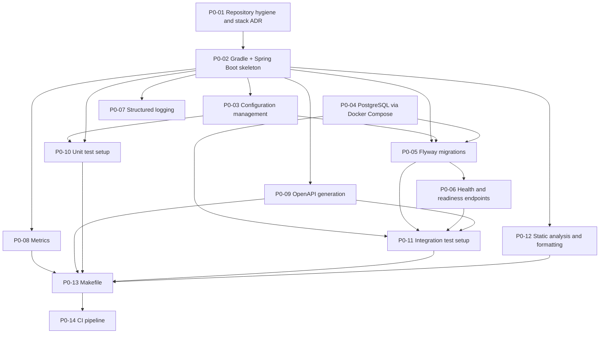

# Tutorial — Turning BootCamp Phase Plans into Linear Tickets

This tutorial explains how the team converts a HyperScale Commerce BootCamp
phase plan into Linear work items, and gives a fully worked, ready-to-paste
example for Phase 0.

Read this together with:

- `docs/bootcamp/current-phase.md` — the active phase and its milestones
- `docs/bootcamp/phase-NN.md` — phase goals, constraints, acceptance criteria
- `docs/bootcamp/phase-NN-plan.md` — the approved task breakdown

---

## 1. The mapping

The BootCamp documents already contain everything Linear needs. Do not invent
new scope while transferring; copy the plan verbatim.

| BootCamp artifact | Linear artifact |
|---|---|
| Phase document `docs/bootcamp/phase-NN.md` | **Project** (e.g. "Phase 00 — Engineering Foundation") |
| Phase `Objective` + `Goals` | Project description |
| Phase `Constraints` (forbidden technologies) | Project description, "Out of scope" section |
| Phase `Definition of Done` | Project milestone "Phase exit criteria" |
| A task in `phase-NN-plan.md` (e.g. `P0-01`) | **Issue**, titled `P0-01 — <task title>` |
| Task `Objective` | First paragraph of the issue description |
| Task `Files/components` | "Files/components" section of the issue description |
| Task `Dependencies` | Linear relations: `blocked by` on this issue, `blocks` on the dependency |
| Task `Acceptance criteria` | Markdown checklist in the issue description |
| Task `Verification method` | "Verification (Definition of Done)" section; must be runnable evidence |
| Task `Architecture impact` | Label `architecture-impact` when non-trivial, plus a link to the relevant doc |
| Plan section "Architecture Impact" saying an ADR is required | Label `needs-adr` + link to `docs/adr/` |
| Plan section "Risks" | Project description, "Risks" section (not separate issues) |
| Plan "Dependency graph" | The complete set of `blocks` / `blocked by` relations |
| Plan "Suggested execution order" | Issue ordering / priority inside the project |

Rules that keep Linear and the repository in sync:

1. The plan file is the source of truth. If a ticket and the plan disagree,
   fix the plan first (through the normal approval flow), then the ticket.
2. Never split or merge tasks in Linear. One plan task = one Linear issue.
3. Acceptance criteria are copied word for word. Rewording them changes the
   contract with the phase review.

---

## 2. Worked example — Phase 0

Source documents: `docs/bootcamp/phase-00.md` and
`docs/bootcamp/phase-00-plan.md`.

### 2.1 Project

- **Project name:** Phase 00 — Engineering Foundation
- **Description:** Create a production-quality development foundation before
  implementing business functionality. The result should be a boring,
  reliable repository.
- **Out of scope (phase constraints):** Kafka, Redis, Kubernetes,
  microservices, CQRS, Elasticsearch, event sourcing, and any business
  feature.
- **Milestone — phase exit criteria:** a clean checkout can execute
  `make test` and `make verify` without manual intervention beyond required
  local infrastructure.
- **Label applied to every issue:** `phase-00`

### 2.2 Issues

Each block below is ready to paste into Linear: the heading is the issue
title, the body is the issue description.

---

#### P0-01 — Repository hygiene and stack ADR

**Objective:** Make the repository committable and record the stack decision.

**Files/components:** `.gitignore`, `README.md`,
`docs/adr/0001-technology-stack.md`, initial git commit.

**Acceptance criteria**

- [ ] `.gitignore` covers Gradle/Java/IDE artifacts
- [ ] README documents prerequisites (JDK 21, Docker, Make) and setup steps
- [ ] ADR-0001 records problem, alternatives, decision, operational cost

**Verification (Definition of Done):** Manual review; `git status` clean after
commit; clone simulation shows no build artifacts.

**Architecture impact:** None (documentation only; ADR records, does not
change, architecture).

**Relations:** none.

**Labels:** `phase-00`, `needs-adr`

---

#### P0-02 — Gradle + Spring Boot application skeleton

**Objective:** Buildable, startable application with no business logic.

**Files/components:** `settings.gradle.kts`, `build.gradle.kts`, Gradle
wrapper files, `app/src/main/java/.../Application.java`,
`app/src/main/resources/application.yml` (minimal).

**Acceptance criteria**

- [ ] Clean-checkout build works using only the wrapper and JDK 21
- [ ] No business code present

**Verification (Definition of Done):** `./gradlew build` succeeds;
application starts and exits with graceful shutdown on SIGTERM.

**Architecture impact:** Establishes the modular-monolith container (single
deployable). Consistent with `docs/architecture.md`.

**Relations:** blocked by P0-01; blocks P0-03, P0-05, P0-06, P0-07, P0-08,
P0-09, P0-10, P0-12.

**Labels:** `phase-00`, `architecture-impact`

---

#### P0-03 — Configuration management

**Objective:** Externalized, typed, validated configuration.

**Files/components:** `application.yml`, `application-local.yml`,
`application-test.yml`, typed `@ConfigurationProperties` class with
validation.

**Acceptance criteria**

- [ ] No secrets in source
- [ ] Environment overrides work
- [ ] Graceful shutdown enabled via config

**Verification (Definition of Done):** Unit test that config binds from
properties; startup failure on invalid/missing required values.

**Architecture impact:** None.

**Relations:** blocked by P0-02; blocks P0-05, P0-10.

**Labels:** `phase-00`

---

#### P0-04 — PostgreSQL via Docker Compose

**Objective:** Local PostgreSQL with one command.

**Files/components:** `compose.yaml` (PostgreSQL 16, healthcheck, named
volume, dev-only credentials via environment defaults).

**Acceptance criteria**

- [ ] Database reachable on documented port
- [ ] Data survives container restart via volume

**Verification (Definition of Done):** `docker compose up -d` then
`docker compose ps` reports healthy; `pg_isready` succeeds.

**Architecture impact:** Confirms PostgreSQL as source of truth (already
mandated by docs).

**Relations:** none blocking it (parallel with P0-02/P0-03); blocks P0-05,
P0-11.

**Labels:** `phase-00`

---

#### P0-05 — Flyway migrations

**Objective:** Automatic, versioned schema management.

**Files/components:** Flyway dependencies, `V1__baseline.sql`, datasource +
Flyway config in `application.yml`.

**Acceptance criteria**

- [ ] Migrations run automatically at startup
- [ ] App fails fast if migration fails
- [ ] No business tables created

**Verification (Definition of Done):** Start app against Compose PostgreSQL;
confirm `flyway_schema_history` contains V1; restart app and confirm
idempotency.

**Architecture impact:** None.

**Relations:** blocked by P0-02, P0-03, P0-04; blocks P0-06, P0-11.

**Labels:** `phase-00`

---

#### P0-06 — Health and readiness endpoints

**Objective:** Liveness and readiness probes.

**Files/components:** Actuator dependency, health group config in
`application.yml`.

**Acceptance criteria**

- [ ] Readiness goes DOWN when the database is unreachable
- [ ] Liveness stays UP

**Verification (Definition of Done):** Integration test asserts
`/actuator/health/liveness` = UP and `/actuator/health/readiness` reflects
database state.

**Architecture impact:** None.

**Relations:** blocked by P0-02, P0-05; blocks P0-11.

**Labels:** `phase-00`

---

#### P0-07 — Structured logging

**Objective:** JSON structured logs suitable for aggregation.

**Files/components:** `logback-spring.xml`, logstash-logback-encoder
dependency.

**Acceptance criteria**

- [ ] No secrets or sensitive data in log config
- [ ] Local profile keeps human-readable logs

**Verification (Definition of Done):** Start app with non-local profile;
assert log lines parse as JSON with timestamp, level, logger, message fields.

**Architecture impact:** None.

**Relations:** blocked by P0-02.

**Labels:** `phase-00`

---

#### P0-08 — Metrics

**Objective:** Application metrics endpoint.

**Files/components:** micrometer-registry-prometheus dependency, actuator
exposure config.

**Acceptance criteria**

- [ ] Endpoint returns 200 with non-empty metric set

**Verification (Definition of Done):** Integration test asserts
`/actuator/prometheus` returns Prometheus-format metrics including JVM and
HTTP metrics.

**Architecture impact:** None.

**Relations:** blocked by P0-02; blocks P0-13.

**Labels:** `phase-00`

---

#### P0-09 — OpenAPI generation

**Objective:** Generated API specification and documentation UI.

**Files/components:** springdoc-openapi dependency, OpenAPI metadata config
bean.

**Acceptance criteria**

- [ ] `/v3/api-docs` and `/swagger-ui.html` available in local profile
- [ ] Spec reflects actual endpoints (actuator excluded from business API
      groups)

**Verification (Definition of Done):** Integration test asserts
`/v3/api-docs` returns a valid OpenAPI 3 document.

**Architecture impact:** None.

**Relations:** blocked by P0-02; blocks P0-11, P0-13.

**Labels:** `phase-00`

---

#### P0-10 — Unit test setup

**Objective:** Working unit test infrastructure.

**Files/components:** JUnit 5 + AssertJ dependencies, Gradle `test` task
config, one sample unit test (e.g., config binding test from P0-03).

**Acceptance criteria**

- [ ] Tests run without Docker or a database

**Verification (Definition of Done):** `./gradlew test` runs and passes; test
report generated.

**Architecture impact:** None.

**Relations:** blocked by P0-02, P0-03; blocks P0-13.

**Labels:** `phase-00`

---

#### P0-11 — Integration test setup (Testcontainers)

**Objective:** Isolated, disposable PostgreSQL for integration tests.

**Files/components:** `integrationTest` source set + Gradle task,
Testcontainers PostgreSQL dependency, base test class, integration tests for
connectivity/Flyway/health/OpenAPI (from P0-05/06/09).

**Acceptance criteria**

- [ ] Each test run uses a fresh container
- [ ] Tests are independent of local environment state

**Verification (Definition of Done):** `./gradlew integrationTest` passes with
Docker running; tests do not touch the Compose database.

**Architecture impact:** None (test infrastructure only).

**Relations:** blocked by P0-04, P0-05, P0-06, P0-09; blocks P0-13.

**Labels:** `phase-00`

---

#### P0-12 — Static analysis and formatting

**Objective:** Enforceable formatting and static analysis.

**Files/components:** Spotless plugin config (google-java-format), Checkstyle
config, Gradle `check` wiring.

**Acceptance criteria**

- [ ] `check` task includes format and static analysis gates

**Verification (Definition of Done):**
`./gradlew spotlessCheck checkstyleMain checkstyleTest` passes; a deliberately
misformatted file fails the build.

**Architecture impact:** None. Enforces "architecture must be enforceable" for
style rules.

**Relations:** blocked by P0-02; blocks P0-13.

**Labels:** `phase-00`

---

#### P0-13 — Makefile

**Objective:** Single entry point for local workflows.

**Files/components:** `Makefile` with `build`, `up`, `down`, `test`,
`integration-test`, `verify`.

**Acceptance criteria**

- [ ] `make verify` = format check + static analysis + compile + unit tests +
      integration tests
- [ ] `make test` = unit + integration tests

**Verification (Definition of Done):** From a clean checkout: `make test` and
`make verify` succeed with only JDK 21 + Docker installed.

**Architecture impact:** None.

**Relations:** blocked by P0-02 through P0-12; blocks P0-14.

**Labels:** `phase-00`

---

#### P0-14 — CI pipeline

**Objective:** Automated verification of every change.

**Files/components:** `.github/workflows/ci.yml`.

**Acceptance criteria**

- [ ] Pipeline fails if any stage fails
- [ ] Gradle cache used
- [ ] Pipeline runs on hosted runners without manual infrastructure

**Verification (Definition of Done):** Push triggers pipeline; all six
required stages (dependency install, compilation, unit tests, integration
tests, static analysis, formatting verification) run green.

**Architecture impact:** None.

**Relations:** blocked by P0-13.

**Labels:** `phase-00`

---

## 3. Dependency graph as Linear relations

The plan's dependency graph translates into these relations. In Linear, set
the `blocked by` side; the `blocks` side is created automatically.

| Issue | Blocked by | Blocks |
|---|---|---|
| P0-01 | — | P0-02 |
| P0-02 | P0-01 | P0-03, P0-05, P0-06, P0-07, P0-08, P0-09, P0-10, P0-12 |
| P0-03 | P0-02 | P0-05, P0-10 |
| P0-04 | — | P0-05, P0-11 |
| P0-05 | P0-02, P0-03, P0-04 | P0-06, P0-11 |
| P0-06 | P0-02, P0-05 | P0-11 |
| P0-07 | P0-02 | — |
| P0-08 | P0-02 | P0-13 |
| P0-09 | P0-02 | P0-11, P0-13 |
| P0-10 | P0-02, P0-03 | P0-13 |
| P0-11 | P0-04, P0-05, P0-06, P0-09 | P0-13 |
| P0-12 | P0-02 | P0-13 |
| P0-13 | P0-02 … P0-12 | P0-14 |
| P0-14 | P0-13 | — |

Suggested execution order (use it for issue priority/order in the project):
P0-01 → P0-02 → P0-03 → P0-04 → P0-05 → P0-06 → P0-07 → P0-08 → P0-09 →
P0-10 → P0-11 → P0-12 → P0-13 → P0-14.

---

## 4. Repeat for later phases

Every phase follows the same file convention:

- `docs/bootcamp/phase-NN.md` — the phase contract (objective, goals,
  constraints, acceptance criteria, definition of done) → the Linear
  **Project**
- `docs/bootcamp/phase-NN-plan.md` — the approved task breakdown
  (`PNN-01`, `PNN-02`, …) → the Linear **Issues**
- `docs/bootcamp/current-phase.md` — which phase is active, its allowed and
  forbidden technologies, and the milestone list with current status

Use `current-phase.md` to decide what belongs in the active project and to
keep issue status honest. For Phase 18 the milestones are P18-01 … P18-08,
e.g. "P18-01: Kotlin/JVM Baseline and ADR-0027", "P18-04: Deterministic
Concurrency and Context-Safety Verification", through "P18-08: Phase 18
Evidence Dossier and Formal Phase Review". Those milestone names become the
issue titles, and the status annotations in `current-phase.md`
(`COMPLETED`, `REMEDIATION REQUIRED`, `PENDING`, `NOT QUALIFIED`) map to
Linear issue states:

| `current-phase.md` annotation | Linear state |
|---|---|
| COMPLETED | Done |
| IN PROGRESS / PENDING | In Progress |
| REMEDIATION REQUIRED / NOT QUALIFIED | Todo (reopened), labelled `remediation` |
| NOT COMPLETE | Todo |

A phase's forbidden-technology list belongs in the project description so
that scope creep is visible before an issue is picked up.

Checklist for creating the next phase's project:

1. Create the project from `phase-NN.md`; paste goals, constraints, and the
   definition of done.
2. Create one issue per task in `phase-NN-plan.md`, verbatim.
3. Add relations from the plan's dependency graph.
4. Order issues by the plan's suggested execution order.
5. Label every issue `phase-NN`; add `needs-adr` where the plan says an ADR
   is required.
6. Add the phase review (the last milestone) as the final issue; it is
   blocked by every other issue in the project.

---

## 5. Team conventions

- **Issue ID = task ID.** The Linear issue title always starts with the plan
  task ID (`P0-07 — Structured logging`). Branch names, commit messages, and
  PR titles reuse the same ID so the plan, the ticket, and the git history
  are searchable by one string.
- **One label per phase.** Exactly one `phase-NN` label per issue. An issue
  that turns out to belong to another phase is moved, not double-labelled.
- **Flag ADR-requiring tickets.** Any task whose `Architecture impact` is
  more than "None", or that the plan's Architecture Impact section says needs
  a decision record, gets the `needs-adr` label and a link to the ADR (or to
  `docs/adr/` until the ADR exists). Such an issue is not Done until the ADR
  is merged.
- **Acceptance criteria are checklists, not prose.** Reviewers tick boxes
  with evidence (command output, test name, dashboard link) in a comment.
- **Verification is a command, not an opinion.** Every issue states how it is
  verified; "looks fine" is never a valid closing comment.
- **Link the docs.** Each issue links back to its `phase-NN-plan.md` section,
  and each project links to `phase-NN.md`.
